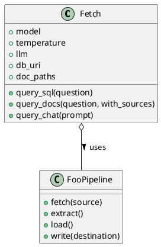
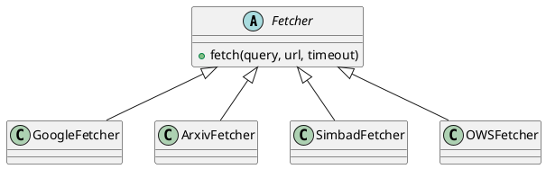
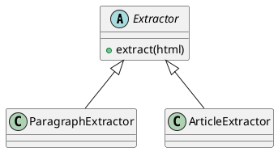
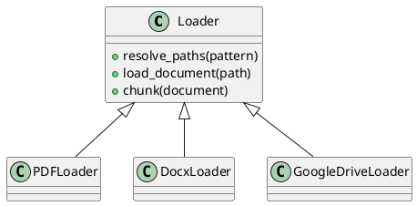
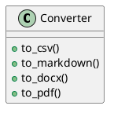
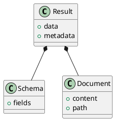
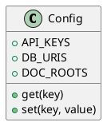

###### foo

 


*A Modular Python Framework for Retrieval-Augmented Pipelines and Agentic Workflows*

<p align="left">
  <a href="https://github.com/is-leeroy-jenkins/Foo/actions"></a>
  <a href="https://github.com/is-leeroy-jenkins/Foo/blob/main/LICENSE"></a>
  <a href="https://pypi.org/project/foo/"></a>
  <a href="https://github.com/is-leeroy-jenkins/Foo/issues"></a>
  <a href="https://github.com/is-leeroy-jenkins/Foo/graphs/contributors"></a>
  <a href="https://python.org"></a>
</p>


## 📚 Table of Contents

* [Features](#features)
* [Architecture](#architecture)
* [Directory Structure](#directory-structure)
* [Installation](#installation)
* [Environments](#environments)
* [Quick Start](#quick-start)
* [Usage Examples](#usage-examples)
* [Dependencies](#dependencies)
* [UML Class Diagrams](#uml-class-diagrams)
* [Module Examples](#module-examples)
* [Module/Class Summaries](#moduleclass-summaries)
* [Technical Notes](#technical-notes)
* [License](#license)
* [Acknowledgments](#acknowledgments)

## ✨ Features

* End-to-end pipeline: fetch → scrape → parse → extract → load → write
* Unified multi-tool orchestrator for SQL, document, API, and LLM querying
* Modular, type-safe, and explicitly documented base classes for extension
* Robust error handling (guard clauses, custom exception patterns)
* LLM/RAG-ready: supports OpenAI, Google, LangChain, ChromaDB, and more
* Integrates with APIs, vector DBs, file systems, document stores, and web resources
* Designed for CI/CD, automated testing, and advanced data workflows


## 🏛️ Architecture

The Foo framework uses a **layered, class-driven pipeline** architecture:

```
Fetcher → Scraper/Parser → Extractor → Loader → Converter → Writer
```

* **Fetchers:** Retrieval from HTTP, APIs, files, DBs
* **Extractors:** Chunking, entity/field extraction
* **Loaders:** File/document/data ingestion (PDF, DOCX, Drive, etc.)
* **Converters:** Cross-format normalization and export (Markdown, CSV, etc.)
* **Core:** Orchestrates pipeline and agentic/LLM workflows


## 🧬 Directory Structure

```
foo/
├── __init__.py
├── core.py               # Pipeline orchestration & public API (Fetch, FooPipeline, etc.)
├── data.py               # Domain models, DTOs, schema helpers (Result, Schema, etc.)
├── extractors.py         # Field/entity extraction logic (Extractor, ArticleExtractor)
├── fetchers.py           # HTTP/file/API fetchers (Fetcher, GoogleFetcher, etc.)
├── loaders.py            # Document loaders (PDF, DOCX, Google Drive, etc.)
├── converters.py         # Format conversion utilities (Markdown, CSV, PDF, etc.)
├── config.py             # Central configuration, settings, API keys
├── requirements.txt      # Dependency list
```


## 🛡️ Installation

**Python 3.9+ required**

```bash
git clone https://github.com/is-leeroy-jenkins/Foo.git
cd Foo
python -m venv .venv
.venv/bin/pip install -r requirements.txt
```

**For development:**

```bash
.venv/bin/pip install -r dev-requirements.txt
```


## Environments

It is recommended to use a `.venv` virtual environment for local development and CI/CD.

**macOS / Linux / WSL**

```bash
python3 -m venv .venv
source .venv/bin/activate
pip install --upgrade pip setuptools wheel
pip install -r requirements.txt
```

**Windows — PowerShell**

```powershell
python -m venv .venv
.\.venv\Scripts\Activate.ps1
pip install --upgrade pip setuptools wheel
pip install -r requirements.txt
```

**Windows — CMD**

```cmd
python -m venv .venv
.venv\Scripts\activate.bat
pip install --upgrade pip setuptools wheel
pip install -r requirements.txt
```


## 🚀 Quick Start

```python
from foo.core import Fetch

fetcher = Fetch(model='gpt-4o', db_uri='sqlite:///foo.sqlite', doc_paths=['docs/*.pdf'])
response = fetcher.query_docs("Summarize the uploaded PDFs.")
print(response)
```


## 🔍 Usage Examples

**Fetch and Extract Web Page:**

```python
from foo.fetchers import GoogleFetcher

fetcher = GoogleFetcher()
result = fetcher.fetch(query="LLMs in Finance", url=None)
print(result.text)
```

**Article Extraction:**

```python
from foo.extractors import ArticleExtractor

extractor = ArticleExtractor()
text = extractor.extract(html="<article>This is the body.</article>")
print(text)
```

**Document Loader:**

```python
from foo.loaders import PDFLoader

loader = PDFLoader()
document = loader.load_document("reports/annual_report.pdf")
for chunk in loader.chunk(document):
    print(chunk)
```

**Data Conversion:**

```python
from foo.converters import Converter

converter = Converter()
csv_data = converter.to_csv("data/input.xlsx")
print(csv_data)
```

**Config Access:**

```python
from foo.config import Config

db_uri = Config.get("DB_URI")
Config.set("MODEL", "gpt-4o")
```


## 📦 Dependencies

| Package                    | Purpose/Description                                                   | Link                                                                                         |
| -------------------------- | --------------------------------------------------------------------- | -------------------------------------------------------------------------------------------- |
| **beautifulsoup4**         | HTML/XML parsing and web scraping                                     | [PyPI](https://pypi.org/project/beautifulsoup4/)                                             |
| **requests**               | HTTP client for API/web requests                                      | [PyPI](https://pypi.org/project/requests/)                                                   |
| **playwright**             | Headless browser automation (dynamic web scraping)                    | [PyPI](https://pypi.org/project/playwright/)                                                 |
| **google**, **googlemaps** | Google APIs, Search, Geocoding, Maps                                  | [PyPI](https://pypi.org/project/google/), [googlemaps](https://pypi.org/project/googlemaps/) |
| **google-genai**           | Access Google Generative AI (Gemini, etc.)                            | [PyPI](https://pypi.org/project/google-generativeai/)                                        |
| **langchain**              | Framework for LLM-powered apps and RAG pipelines                      | [LangChain](https://python.langchain.com/docs/get_started/installation)                      |
| **langchain-community**    | Community-contributed tools for LangChain                             | [PyPI](https://pypi.org/project/langchain-community/)                                        |
| **chromadb**               | Vector database for storing and searching embeddings                  | [PyPI](https://pypi.org/project/chromadb/)                                                   |
| **pandas**                 | Data analysis and tabular data handling                               | [PyPI](https://pypi.org/project/pandas/)                                                     |
| **numpy**                  | Numeric computing, arrays, math                                       | [PyPI](https://pypi.org/project/numpy/)                                                      |
| **matplotlib**             | Data visualization/plotting                                           | [PyPI](https://pypi.org/project/matplotlib/)                                                 |
| **owslib**                 | Open Geospatial Consortium (OGC) Web Services access (WMS, WFS, etc.) | [PyPI](https://pypi.org/project/OWSLib/)                                                     |
| **astroquery**             | Astronomy data querying and API access                                | [PyPI](https://pypi.org/project/astroquery/)                                                 |
| **unstructured**           | Document parsing and chunking                                         | [Docs](https://unstructured-io.github.io/unstructured/)                                      |
| **pytube**                 | YouTube video downloading and parsing                                 | [PyPI](https://pypi.org/project/pytube/)                                                     |
| **docx2txt**               | Extract text from DOCX files                                          | [PyPI](https://pypi.org/project/docx2txt/)                                                   |
| **pillow**                 | Image processing                                                      | [PyPI](https://pypi.org/project/Pillow/)                                                     |
| **python-pptx**            | Read/write PowerPoint PPTX files                                      | [PyPI](https://pypi.org/project/python-pptx/)                                                |
| **fitz (PyMuPDF)**         | PDF parsing, page rendering, PDF-to-image                             | [PyPI](https://pypi.org/project/PyMuPDF/)                                                    |
| **scikit-learn**           | Machine learning algorithms and utilities                             | [PyPI](https://pypi.org/project/scikit-learn/)                                               |
| **tiktoken**               | Fast BPE tokenization for OpenAI models                               | [PyPI](https://pypi.org/project/tiktoken/)                                                   |
| **pyyaml**                 | YAML file parsing                                                     | [PyPI](https://pypi.org/project/PyYAML/)                                                     |
| **tabulate**               | Pretty-print tabular data in text/markdown                            | [PyPI](https://pypi.org/project/tabulate/)                                                   |
| **python-dotenv**          | Manage `.env` config files for secrets/credentials                    | [PyPI](https://pypi.org/project/python-dotenv/)                                              |
| **typing_extensions**      | Type hinting and typing features for compatibility                    | [PyPI](https://pypi.org/project/typing-extensions/)                                          |

> *See `requirements.txt` for the complete and up-to-date list.*


## 🏗️ UML Class Diagrams

Paste these PlantUML diagrams into [PlantUML Online Server](https://www.plantuml.com/plantuml/uml/)
or your favorite PlantUML viewer to visualize class relationships.

### core.py




### fetchers.py




### extractors.py




### loaders.py




### converters.py




### data.py




### config.py




## 🧑‍💻 Module Examples

**core.py**

```python
from foo.core import Fetch
fetcher = Fetch(model='gpt-4o', db_uri='sqlite:///foo.sqlite', doc_paths=['docs/*.pdf'])
response = fetcher.query_docs("Summarize the uploaded PDFs.")
print(response)
```

**fetchers.py**

```python
from foo.fetchers import GoogleFetcher
fetcher = GoogleFetcher()
result = fetcher.fetch(query="LLMs in Finance", url=None)
print(result.text)
```

**extractors.py**

```python
from foo.extractors import ArticleExtractor
extractor = ArticleExtractor()
text = extractor.extract(html="<article>This is the body.</article>")
print(text)
```

**loaders.py**

```python
from foo.loaders import PDFLoader
loader = PDFLoader()
document = loader.load_document("reports/annual_report.pdf")
for chunk in loader.chunk(document):
    print(chunk)
```

**converters.py**

```python
from foo.converters import Converter
converter = Converter()
csv_data = converter.to_csv("data/input.xlsx")
print(csv_data)
```

**data.py**

```python
from foo.data import Result, Schema, Document
doc = Document(content="sample", path="sample.txt")
schema = Schema(fields=["title", "body"])
result = Result(data=doc, metadata={"source": "test"})
print(result.data.content, result.metadata)
```

**config.py**

```python
from foo.config import Config
db_uri = Config.get("DB_URI")
Config.set("MODEL", "gpt-4o")
```


## 🗂️ Module/Class Summaries

### Fetch (`core.py`)

* **Purpose:** Unified orchestrator for SQL, doc retrieval, embeddings, and LLM chat
* **Attributes:** `model`, `temperature`, `llm`, `db_uri`, `doc_paths`, `memory`, `sql_tool`, `doc_tool`, `api_tools`
* **Public Methods:** `query_sql()`, `query_docs()`, `query_chat()`

### Fetcher (`fetchers.py`)

* **Purpose:** Abstract base for HTTP/file/API retrieval
* **Key Subclasses:** `GoogleFetcher`, `ArxivFetcher`, `SimbadFetcher`, `OWSFetcher`

### Extractor (`extractors.py`)

* **Purpose:** Abstract base for HTML → text/entity extraction
* **Key Subclasses:** `ParagraphExtractor`, `ArticleExtractor`

### Loader (`loaders.py`)

* **Purpose:** Unified loader for PDFs, DOCX, Google Drive, etc.
* **Key Subclasses:** `PDFLoader`, `DocxLoader`, `GoogleDriveLoader`

### Converter (`converters.py`)

* **Purpose:** Utility for converting data formats (CSV, Markdown, DOCX, PDF)

### Data Models (`data.py`)

* **Purpose:** Standardize output and schemas (`Result`, `Schema`, `Document`)

### Config (`config.py`)

* **Purpose:** Central configuration for API keys, DB URIs, document roots, etc.


## ⚙️ Technical Notes

* **Type Safety & Guard Clauses:** All public methods use strict type hints and validation.
* **Error Handling:** Custom `Error`/`ErrorDialog` pattern for rich debugging and robust runtime behavior.
* **Extensibility:** Add new integrations by subclassing base types in each layer.
* **Testing:** Each module/unit is independently testable.
* **Environments:** `.venv`/`requirements.txt` standard, with support for production and development installs.
* **CI/CD:** Designed for use with GitHub Actions (see badge).


## 📝 License

Foo is released under the MIT License.
Copyright © 2022–2025 Terry D. Eppler


## 🙏 Acknowledgments

* Project lead: Terry D. Eppler ([terryeppler@gmail.com](mailto:terryeppler@gmail.com))
* Major dependencies: LangChain, ChromaDB, Google GenAI, OWSLIB, PyPDF, BeautifulSoup, and others
* Inspired by the open-source Python, ML, and LLM communities

