###### foo

*A Multi-Tool Conversational Retrieval, SQL Querying, and Document Intelligence Framework*
**Work-In-Progress Module**


## 🧠 **Overview**

Foo is an extensible Python framework designed to unify:

* Conversational interaction with OpenAI-compatible LLMs
* Deterministic natural-language SQL querying
* Document ingestion and vector-based semantic retrieval
* Tool routing through a LangChain ReAct agent
* Structured error-handling via guard clauses and dialogs

- Foo’s architecture is modular by design, composed of separate tool classes for SQL, document retrieval, and future API integrations. The `Fetch` controller coordinates these tools to provide a predictable, expandable multi-modal reasoning environment.


## 🧮 **Class Architecture**

Foo includes the following classes:

| Class                   | Purpose                                                                                |
| ----------------------- | -------------------------------------------------------------------------------------- |
| **Fetch**               | Main orchestrator; initializes LLM, SQL, doc tools, embeddings, memory, and the agent. |
| **SqlQueryTool**        | Deterministic SQLite execution engine for SQL-only question answering.                 |
| **DocumentQueryTool**   | Retrieval-augmented QA engine using ChromaDB embeddings.                               |
| **ApiTool** *(stub)*    | Future-ready API integration layer.                                                    |
| **Error / ErrorDialog** | Structured error handling from the `booger` library.                                   |
| **throw_if**            | Guard clause utility for parameter validation.                                         |


##  📚 **UML Class Diagram**


## 🧰 **High-Level System Diagram**

```mermaid
flowchart TD

    UserInput[User Input] --> Decide{Determine Query Type}

    Decide -->|SQL Query| SQLTool[SqlQueryTool → SQLite DB]
    Decide -->|Document Question| DocTool[DocumentQueryTool → ChromaDB]
    Decide -->|Conversation| ChatPath[LLM via Fetch]
    Decide -->|Multi-Tool Reasoning| Agent[LangChain ReAct Agent]

    SQLTool --> Answer
    DocTool --> Answer
    ChatPath --> Answer
    Agent --> Answer
```




## ⚙️ **Installation**

Install required dependencies:

```bash
pip install langchain chromadb numpy openai unstructured pypdf python-docx
```

If using OpenAI-compatible models:

```bash
pip install langchain-openai
export OPENAI_API_KEY="your-key"
```


## 🏗️ **Initialize**

```python
from Foo import Fetch

fetch = Fetch(
    db_uri="data/budget.sqlite",
    doc_paths=[
        "docs/PUBLIC_LAW.pdf",
        "docs/OMB_A11.md"
    ],
    model="gpt-4o-mini",
    temperature=0.2
)
```


## 🔍 **SQL Query**

```python
result = fetch.query_sql("List total obligations by fiscal year.")
print(result)
```


## 📚 **Document Retrieval**

```python
result = fetch.query_docs(
    "What does Section 1402 authorize?",
    with_sources=True
)
print(result)
```


## 🤖 **Free-Form Chat**

```python
reply = fetch.query_chat("Explain the difference between BA and OBL.")
print(reply)
```


## 🏗️ **Install & Import**

```python
!pip install langchain chromadb numpy openai unstructured python-docx pypdf

from Foo import Fetch
```


## 🔧 **Initialize Fetch**

```python
fetch = Fetch(
    db_uri="data/budget.sqlite",
    doc_paths=[
        "docs/APPROPRIATIONS_GUIDE.pdf",
        "docs/FINANCIAL_MANAGEMENT_POLICY.md"
    ],
    model="gpt-4o-mini",
    temperature=0.3
)
fetch
```


## 📜 **Run a SQL Query**

```python
fetch.query_sql("Select TAS, SUM(amount) from ledger group by TAS;")
```


## 📁 **Run a Document Retrieval Query**

```python
fetch.query_docs(
    "Summarize the funding limitations described in the guidance.",
    with_sources=True
)
```


## 🧠 **Conversational Query**

```python
fetch.query_chat("Explain SF-132 apportionments at a high level.")
```


## **Public API**

| Class                   | Method                        | Description                                   |
| ----------------------- | ----------------------------- | --------------------------------------------- |
| **Fetch**               | `query_sql()`                 | SQL-only question answering.                  |
|                         | `query_docs()`                | Vector-based retrieval QA.                    |
|                         | `query_chat()`                | Conversational LLM interaction.               |
|                         | `_init_sql_tool()`            | Configure SQLite tool.                        |
|                         | `_init_doc_tool()`            | Configure ChromaDB doc tool.                  |
|                         | `_init_api_tools()`           | Placeholder for future API tools.             |
| **SqlQueryTool**        | `run(query)`                  | Executes SQL against SQLite safely.           |
| **DocumentQueryTool**   | `run(question, with_sources)` | Performs RAG retrieval and answer generation. |
| **ApiTool**             | `run(args)`                   | Stub for future service integrations.         |
| **Error / ErrorDialog** | `show()`                      | Structured exception rendering.               |


## **Dependencies**

| Dependency                    | Purpose                                  | Required       | Notes                                     |
| ----------------------------- | ---------------------------------------- | -------------- | ----------------------------------------- |
| **langchain**                 | Agent framework, tools interface, memory | Yes            | Core orchestration library                |
| **chromadb**                  | Vector store for document embeddings     | Yes            | Stores and retrieves chunks               |
| **openai / langchain-openai** | Chat model support                       | Yes (LLM mode) | Must set `OPENAI_API_KEY`                 |
| **numpy**                     | Embedding/vector operations              | Yes            | Required internally by several components |
| **unstructured**              | Document parsing                         | Recommended    | Supports PDF, HTML, TXT, etc.             |
| **pypdf**                     | PDF ingestion                            | Recommended    | Used by Unstructured backend              |
| **python-docx**               | DOCX ingestion                           | Optional       | Included if DOCX used                     |
| **sqlite3**                   | SQL backend                              | Yes            | Included in Python standard library       |
| **booger**                    | Error and dialog handling                | Yes            | Needed for `Error` and `ErrorDialog`      |
| **tiktoken**                  | Token counting for LLMs                  | Optional       | Recommended for OpenAI models             |


## ⚖️ **License**

MIT License


## 📝 **Author**

**Terry D. Eppler**
**Email:** [terryeppler@gmail.com](mailto:terryeppler@gmail.com)


