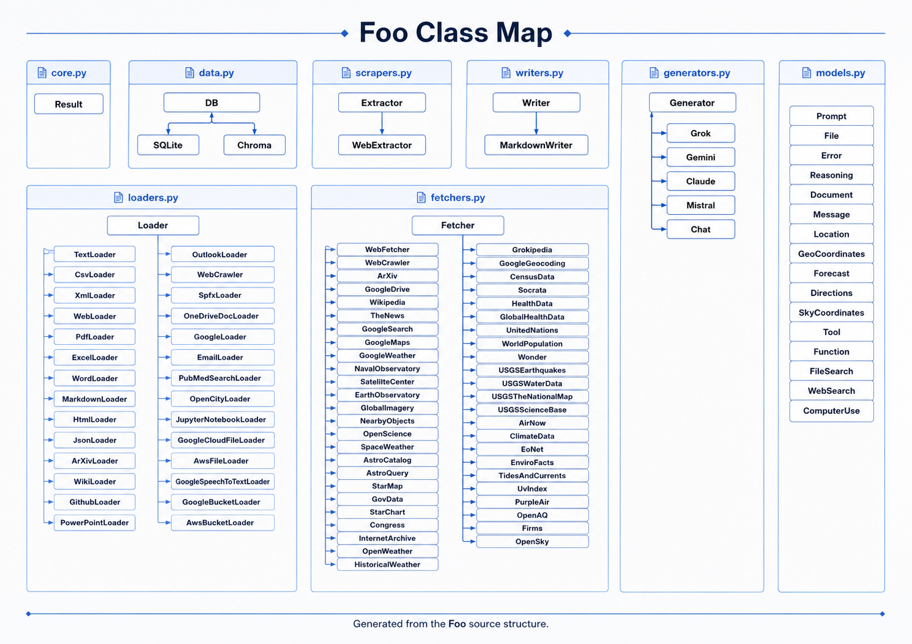

#### API Reference

The Foo API reference is generated from the Python source modules using MkDocs, mkdocstrings, and
Google-style docstrings. These pages document the public classes, functions, methods, properties,
type annotations, and docstring sections exposed by the application modules.

Foo is organized around a small core layer, document ingestion utilities, web and public-data
retrieval components, HTML scraping helpers, AI generation wrappers, persistence utilities,
structured Pydantic models, and Markdown/output writers.

## API Modules

### Core

The `core.py` module provides shared primitives used across the project, including the `Result`
container and validation helpers.

* [`core`](core.md)

### Loaders

The `loaders.py` module contains document loading classes for local files, structured files,
notebooks, cloud documents, web resources, and other supported sources. These classes convert source
content into LangChain `Document` objects for downstream processing.

* [`loaders`](loaders.md)

### Fetchers

The `fetchers.py` module contains retrieval classes for web pages, search providers, public APIs,
scientific data, geospatial data, weather data, environmental data, astronomy data, and government
or public datasets.

* [`fetchers`](fetchers.md)

### Scrapers

The `scrapers.py` module contains HTML extraction utilities for retrieving and cleaning readable
content from web pages.

* [`scrapers`](scrapers.md)

### Generators

The `generators.py` module contains AI provider wrapper classes for text generation and related LLM
workflows.

* [`generators`](generators.md)

### Data

The `data.py` module contains persistence and data-management utilities, including SQLite and
Chroma-oriented classes.

* [`data`](data.md)

### Models

The `models.py` module contains Pydantic schemas used to normalize prompts, files, errors, messages,
tools, locations, coordinates, forecasts, searches, and related structured objects.

* [`models`](models.md)

### Writers

The `writers.py` module contains output writer classes for exporting fetched or processed content,
including Markdown-oriented output.

* [`writers`](writers.md)

