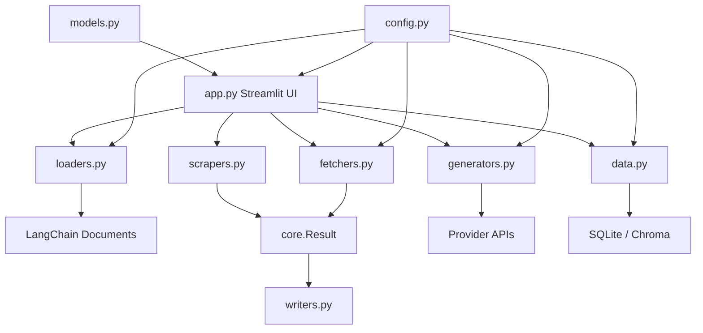

# Architecture

Foo is organized as a modular Streamlit application backed by source modules that can also be used directly from Python.

## Module responsibilities

| Module | Responsibility |
| --- | --- |
| `core.py` | Shared validation and response-result container. |
| `loaders.py` | File, document, cloud, notebook, and search loader wrappers. |
| `scrapers.py` | HTML extraction and lightweight page scraping. |
| `fetchers.py` | Web, public-data, science, geospatial, environmental, and retriever wrappers. |
| `generators.py` | LLM provider wrappers and generation workflows. |
| `data.py` | SQLite and vector-store data helpers. |
| `models.py` | Pydantic schemas used by application workflows. |
| `writers.py` | Markdown writer utilities for persisted results. |
| `config.py` | Environment variables, constants, mode maps, and session-state defaults. |
| `app.py` | Streamlit user interface and workflow orchestration. |
